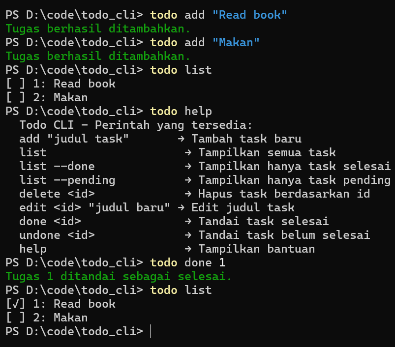

# ToDo CLI

Projek ToDo cli kecil kecilan menggunakan bahasa rust yang saya buat untuk mengasah skill rust saya
Alasan menggunakan rust karena rust sangat cepat, safety dan hemat memory

## Installation

Install [Rust](https://www.rust-lang.org/tools/install) dulu untuk menginstal paket-paket yang dibutuhkan.

## Cara kerja
* File main.rs --> Titik masuk aplikasi (fn main). Di sini program mulai jalan, parsing argumen pakai clap, lalu manggil fungsi dari commands.rs.
* File commands.rs --> Berisi implementasi command utama CLI (add, list, done, remove, dll). File ini yang ngatur interaksi user.
* File storage.rs --> Ngatur cara data disimpan & dibaca. Misalnya save ke file JSON, load lagi saat program dibuka. Jadi persistence logic ada di sini.
* File task.rs --> Definisi struct Task (model data). Juga biasanya ada method buat bikin task baru, update status selesai, dll.


## Fitur
Berikut adalah Fitur/Command yang tersedia: 
* add \"judul task\"       → Tambah task baru
* list                     → Tampilkan semua task
* list --done              → Tampilkan hanya task selesai
* list --pending           → Tampilkan hanya task pending
* delete <id>              → Hapus task berdasarkan id
* edit <id> \"judul baru\" → Edit judul task
* done <id>                → Tandai task selesai
* undone <id>              → Tandai task belum selesai
* help                     → Tampilkan bantuan

## Usage
Pastikan Rust sudah terinstall dan silahkan clone repo ini

```bash
# clone repo
git clone https://github.com/Wicayonima-Reborn/ToDo-CLI-Rust.git

# masuk directory
cd todo_cli
```
Setelah Terclone Pergi Ke terminal
```bash
# Install paket
cargo install --path .

# List command
todo help

# Run
todo <command>
```

## Berikut contoh Run



Pull requests are welcome. For major changes, please open an issue first
to discuss what you would like to change.

Please make sure to update tests as appropriate.

## License

[MIT](https://github.com/Wicayonima-Reborn/ToDo-CLI-Rust/blob/main/LICENSE)